# Antibiotic Resistance Trends Analysis


## Background and Overview

This project analyses **2.15 million+ clinical culture records** from 
Stanford Healthcare EHRs spanning 2008–2023, investigating the culprits, 
patterns, and drivers of antibiotic resistance across demographics, 
care settings, organisms, and socioeconomic contexts.

Antibiotic resistance is a growing global public health threat. The WHO 
2025 GLASS report confirms resistance is widespread and increasing across 
104 countries and 23 million confirmed infections. Yet resistance patterns 
vary considerably at the local level — understanding those variations is 
critical for targeted intervention.

**Dataset:** Antibiotic Resistance Microbiology Dataset (ARMD) — Oct 22, 2025 version  
**Authors:** Deresinski, S.; Asch, S.; Goldstein, M.; Chen, J.  
**Source:** Dryad · DOI: [10.5061/dryad.jq2bvq8kp](https://doi.org/10.5061/dryad.jq2bvq8kp)  
**Tools:** MySQL · Apache Superset   

---

## Data Structure Overview

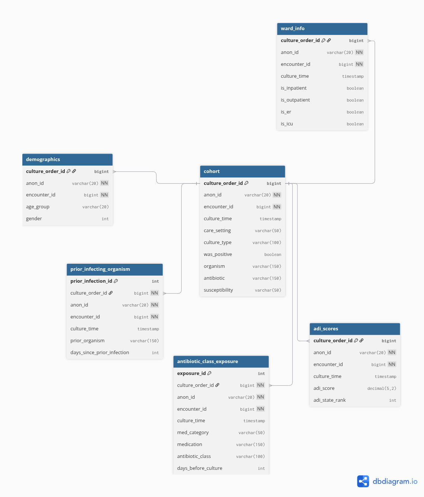


> [Full Data Dictionary](docs/data_dictionary.md)


---

## Executive Summary

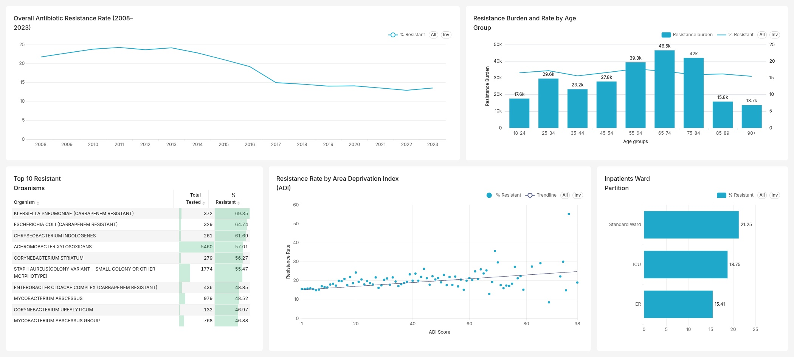

Antibiotic resistance in this dataset is multifactorial rather than driven 
by a single cause. *E. coli* accounts for the largest resistance burden at 
47.55% of all resistant cases, while carbapenem-resistant variants of 
*Klebsiella pneumoniae* (69.35%) and *E. coli* (64.74%) exhibit the highest 
resistance rates. Beta Lactam carries the largest prior antibiotic exposure 
footprint at 5.67M cases, with Ampicillin, Erythromycin, and Penicillin 
remaining the most resistance-prone individual antibiotics.

Resistance is not confined to any single demographic or setting; it is 
shaped by organism type, antibiotic exposure history, patient age, care 
setting, and socioeconomic deprivation simultaneously. The overall resistance 
rate has declined from a peak of ~24% in 2013 to ~13–14% by 2023, suggesting 
stewardship efforts are having measurable impact. However, resistance in 
last-resort drug classes and carbapenem-resistant organisms signals that 
critical vulnerabilities remain.

---

## Methodology

### 1. Data Preparation

The original ARMD dataset consists of multiple clinical tables linked through patient, encounter, and culture identifiers. To support analysis, selected tables were imported into MySQL and standardized into a consistent schema.

Data preparation activities included:

- Renaming source columns to analysis-friendly names
- Reviewing missing values and invalid records
- Validating relationships across tables
- Creating optimized views for repeated analyses
- Adding indexes on join columns to improve query performance

### 2. Data Quality Assessment

A dedicated data quality review was performed on each table before analysis.

| Table | Assessment |
|---------|------------|
| Cohort Results | [View](data_quality/cohort_results.md) |
| Demographics | [View](data_quality/demographics.md) |
| Antibiotic Exposure | [View](data_quality/antibiotic_exposure.md) |
| Prior Infecting Organisms | [View](data_quality/prior_infections.md) |
| Ward Information | [View](data_quality/ward_info.md) |
| ADI Scores | [View](data_quality/adi_scores.md) |

The assessment covered:

- Missing values
- Duplicate records
- Outlier detection
- Distribution checks
- Relationship validation
- Analysis-specific assumptions

### 3. Analytical Framework

The analysis was structured around seven key objectives:

1. Organism & Antibiotic Resistance Patterns
2. Demographic Resistance Trends
3. Ward-Based Resistance Analysis
4. Antibiotic Effectiveness & Prior Exposure
5. Socioeconomic Deprivation & Resistance
6. Prior Infection Impact
7. Temporal Resistance Trends

### 4. Resistance Definition

Throughout this project, resistance rate is defined as:

```text
Resistance Rate = (Resistant Results / Total Tested Results) × 100
```

Records labelled `NOT_TESTED` were excluded from resistance calculations.

### 5. Visualization

Aggregated results were visualized using Apache Superset.

Visualization techniques included:

- Horizontal bar charts
- Mixed bar-line charts
- Time-series trend charts
- Correlation plots
- Distribution charts

---

## Insights Deep Dive

### 1. Organism & Antibiotic Resistance Patterns

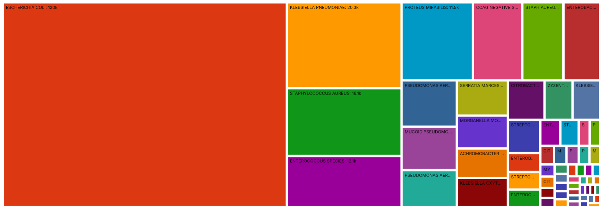

*E. coli* dominates resistance burden, accounting for nearly half of all 
resistant cases in the dataset. However, burden and rate tell different 
stories; carbapenem-resistant variants of *Klebsiella pneumoniae* and 
*E. coli* lead by resistance rate at 69.35% and 64.74% respectively, 
followed by *Chryseobacterium indologenes* at 61.69%.

On the antibiotic side, Erythromycin (49.77%), Ampicillin (48.12%), and 
Penicillin (41.29%) record the highest resistance rates from susceptibility 
testing. Beta Lactam carries the largest prior exposure footprint at 5.67M 
cases — reinforcing the carbapenem resistance pressure observed at the 
organism level.

> See [Appendix A](#appendix-a) for full organism and antibiotic ranked tables.

---

### 2. Demographic Resistance Trends

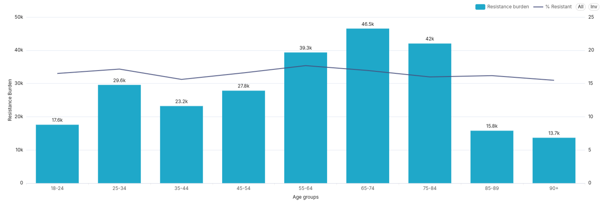

Adults aged 55–84 carry the highest resistance burden, peaking at 46,500 
cases in the 65–74 group. By resistance rate however, the 55–64 group leads 
at 17.69%, closely followed by the 25–34 group at 17.17%, an unexpected 
finding for a younger working-age cohort.

The narrow rate range across all age groups (15.48%–17.69%) confirms 
resistance is broadly distributed rather than concentrated in any single 
demographic. Analysis of the 25–34 group by care setting revealed near-equal 
resistance rates across inpatient (17.43%) and outpatient (16.90%) settings, 
suggesting community-driven factors such as antibiotic self-medication are 
more likely drivers than healthcare exposure.

---

### 3. Ward-Based Resistance Analysis

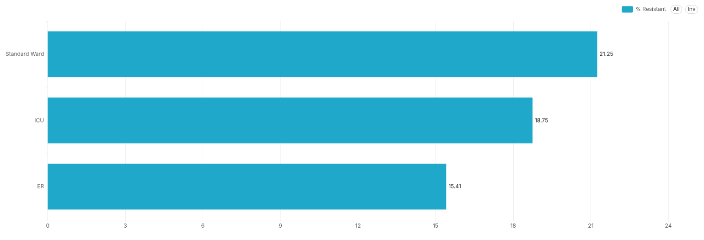

Inpatient settings show higher resistance rates (17.67%) than outpatient 
settings (15.30%), consistent with greater antibiotic pressure in hospital 
environments. Within inpatient settings, Standard Ward (21.25%) paradoxically 
outpaces ICU (18.75%) — the most counterintuitive finding in this analysis.

This suggests ICU stewardship protocols are more rigorous and targeted than 
standard ward settings, where broader and less monitored antibiotic courses 
likely drive resistance rates higher. The inpatient-outpatient gap of 2.37 
percentage points is modest; the more clinically significant story lies 
within the ward partition.

> See [Appendix B](#appendix-b) for care setting and ward partition charts.

---

### 4. Antibiotic Effectiveness & Prior Exposure

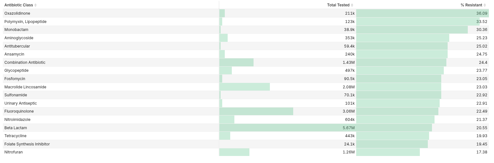

Among patients with prior antibiotic exposure, Oxazolidinone (36.09%), 
Polymyxin/Lipopeptide (33.52%), and Monobactam (30.36%) classes show the 
highest resistance rates, all last-resort or reserve drug classes. Beta 
Lactam, while lower in rate at 20.55%, carries the largest exposure volume 
at 5.67M cases.

Recency of prior antibiotic exposure is not a strong predictor of resistance. 
Rates remain consistently between 23.92% and 24.23% across all exposure 
windows from within 30 days to beyond a year, only declining modestly to 
21.27% beyond 365 days. Prior exposure class is a stronger predictor than 
how recently exposure occurred.

A notable spike: Tetracycline recorded 77–80% resistance rates between 
2013–2015 before declining sharply, likely reflecting reduced clinical use.

> See [Appendix C](#appendix-c) for antibiotic class resistance table and 
exposure recency charts.

---

### 5. Socioeconomic Deprivation & Resistance (ADI)

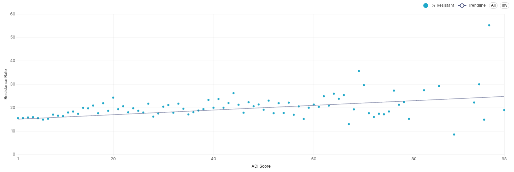

A clear positive correlation exists between Area Deprivation Index (ADI) 
score and resistance rate. Patients from the most deprived communities face 
approximately 10 percentage points higher resistance rates than the least 
deprived — rising from ~15% at ADI 1 to ~25% at ADI 98.

ADI groups with fewer than 100 records were excluded to ensure statistical 
reliability, removing 12 of 99 ADI groups. The trendline (y = 0.1x + 15) 
confirms a consistent upward drift across the full deprivation spectrum, 
establishing socioeconomic deprivation as a measurable and independent 
resistance driver.

---

### 6. Prior Infection Impact


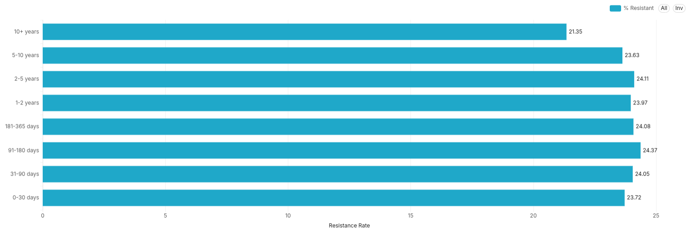

Resistance rates remain consistently between 23.63% and 24.37% across all 
prior infection recency buckets from within 30 days through 2–5 years, with 
only a modest decline to 21.35% beyond 10 years. This mirrors the antibiotic 
exposure recency finding almost exactly.

Prior infection history establishes a persistent resistance profile that does 
not decay meaningfully with time. Resistance screening should not be limited 
to patients with recent infection histories — anyone with a documented prior 
infection warrants consideration regardless of timing.

---

### 7. Temporal Resistance Trends

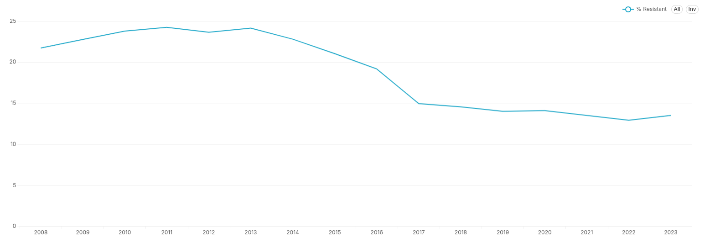

Overall resistance rates climbed from ~22% in 2008 to a peak of ~24% in 2013, 
followed by a consistent decline and a sharp ~5% dip between 2016 and 2017. 
Rates have since stabilised at approximately 13–14% from 2019 to 2023 — 
a meaningful improvement from the peak, though the plateau suggests further 
gains require sustained effort.

At the individual antibiotic level, Meropenem, Ertapenem, and Amikacin show 
dramatic resistance rate declines across the observation period. Ampicillin, 
Erythromycin, and Penicillin remain persistently high and show worsening 
trends. Tetracycline recorded the most dramatic single-period spike at 
77–80% between 2013–2015 before declining sharply.

---

## Recommendations

### Clinical
- Prioritise **Standard Ward antibiotic stewardship** programmes as the 
  highest-impact intervention target
- Extend resistance screening to all patients with prior infection or 
  antibiotic exposure history **regardless of recency**
- Heighten surveillance for carbapenem-resistant *K. pneumoniae* and *E. coli*
- Investigate the elevated resistance rate in the **25–34 age group** for 
  community transmission or self-medication patterns

### Public Health
- Target community-level AMR interventions in **high-ADI areas**
- Use ADI score as a **risk stratification tool** for resistance screening 
  programmes

### Data & Systems
- Standardise medication naming in EHR systems to resolve brand name, 
  generic name, and formulation duplicates
- Expand ADI data capture to reduce the proportion of unknown scores
- Implement a medication name mapping table for future analyses

---

## Limitations

- **Medication name standardization:** Brand names, generics, and formulation 
  variants recorded inconsistently — resistance rates at medication level may 
  be understated. Antibiotic class level is recommended as the more reliable 
  unit of analysis
- **ADI missingness:** Patients with unknown ADI scores excluded from 
  deprivation analysis — findings may not fully represent the complete 
  patient population
- **Carbapenem class isolation:** Carbapenems are subsumed under Beta Lactam 
  in the exposure table — carbapenem-specific class-level analysis not possible
- **Cross-sectional culture data:** Causal relationships between exposure and 
  resistance cannot be established from this data structure
- **Pre-2008 records:** Represent less than 0.8% of the dataset — retained 
  in aggregate analyses without materially affecting results
- **2024 data:** Partial year only — excluded from temporal trend analysis

---

## Appendices

### Appendix A
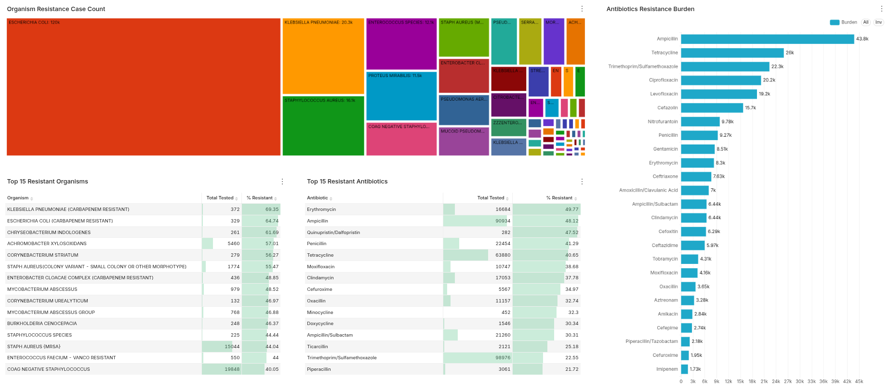
Full organism and antibiotic ranked tables — resistance rate and burden


### Appendix B
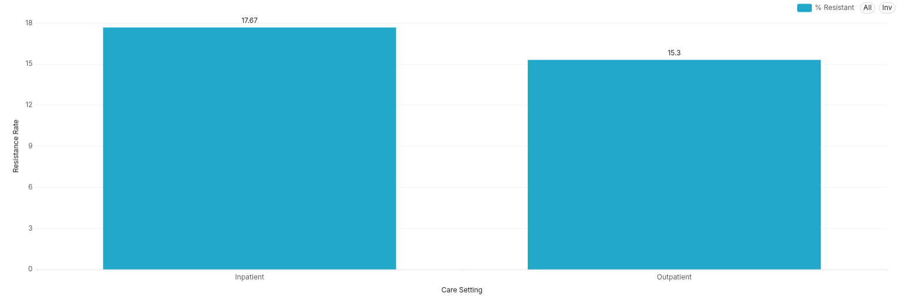 
Care setting bar chart and inpatient ward partition chart

### Appendix C — Antibiotic Exposure Analysis


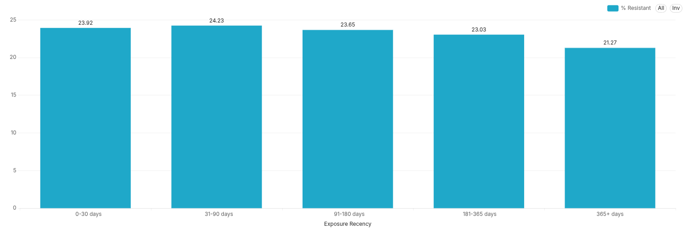

### Appendix D — Data Quality Reports

Detailed data quality assessments are available for each table:

- [Cohort Results](data_quality/cohort_results.md)
- [Demographics](data_quality/demographics.md)
- [Antibiotic Exposure](data_quality/antibiotic_exposure.md)
- [Prior Infecting Organisms](data_quality/prior_infections.md)
- [Ward Information](data_quality/ward_info.md)
- [ADI Scores](data_quality/adi_scores.md)

Each report includes completeness checks, duplicate analysis, distribution reviews, and analytical considerations.

### Appendix E — SQL Queries

All data cleaning, validation, and quality check queries are documented 
inline within each table's data quality report:

| Table | Queries |
|-------|---------|
| Cohort Results | [View](data_quality/cohort_results.md) |
| Demographics | [View](data_quality/demographics.md) |
| Antibiotic Exposure | [View](data_quality/antibiotic_exposure.md) |
| Prior Infecting Organisms | [View](data_quality/prior_infections.md) |
| Ward Information | [View](data_quality/ward_info.md) |
| ADI Scores | [View](data_quality/adi_scores.md) |

Visualization and analytical queries are available in:
- [visuals_query.sql](sql/analysis_queries.sql)
- [schema.sql](sql/schema.sql)
- [indexes.sql](sql/indexes.sql)
